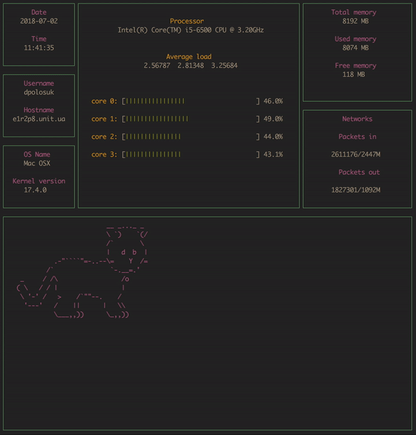

# ft\_gkrellm

This is a quick project from CPP pool in school 42.

The goal of this project was to create sort of our own implementation of [GKrellM](http://gkrellm.srcbox.net/) in two days.

Teams are chosen randomly.

----------



## Want to try it out?

Probably you can't, because we used some Mac OS specific stuff, but you can try.

```{bash}
$ git clone https://github.com/Dornat/SysMonitor.git
$ cd SysMonitor
$ make
$ ./ft_gkrellm
```

## Subject

Modules				|Completion
--------------------|--------------
Hostname/username	|Done
OS info				|Done
Date/time			|Done
CPU					|Done
RAM					|Done
Network throughput	|Done
The Cat	=^.\_.^= ∫	|Done
